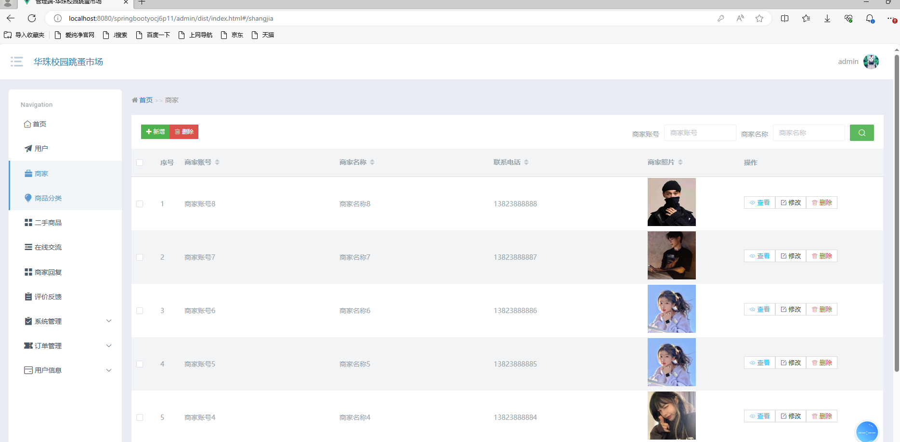
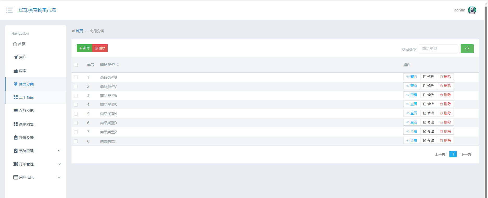
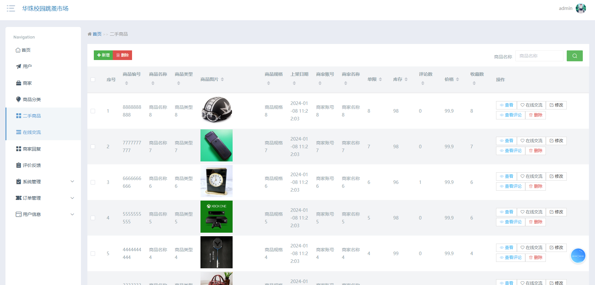
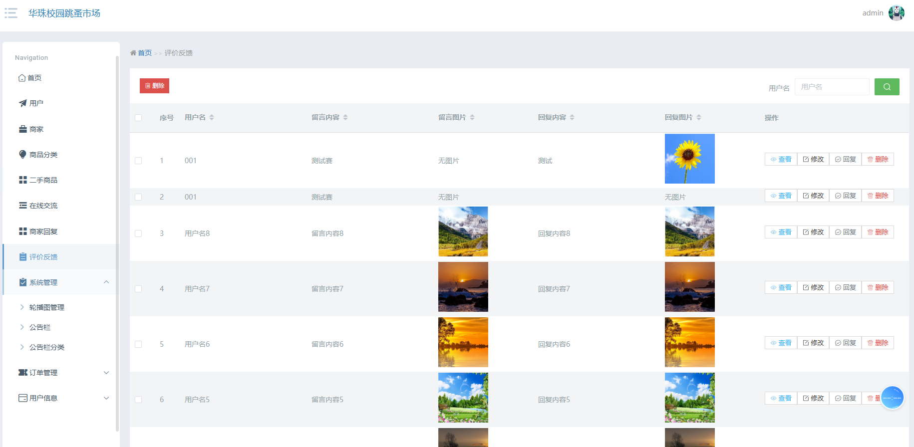
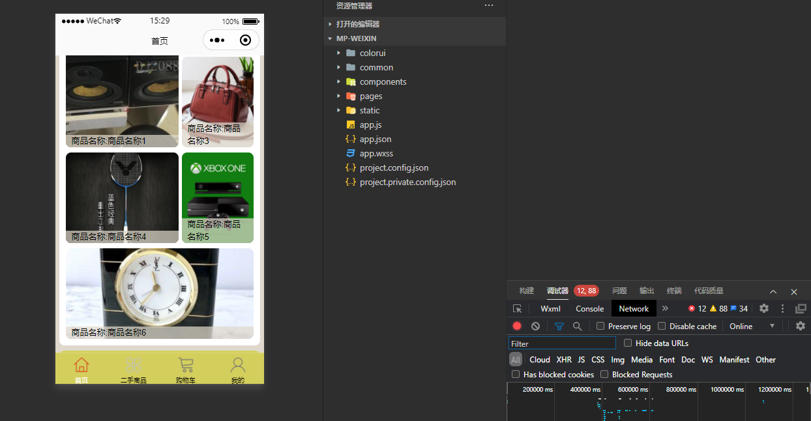
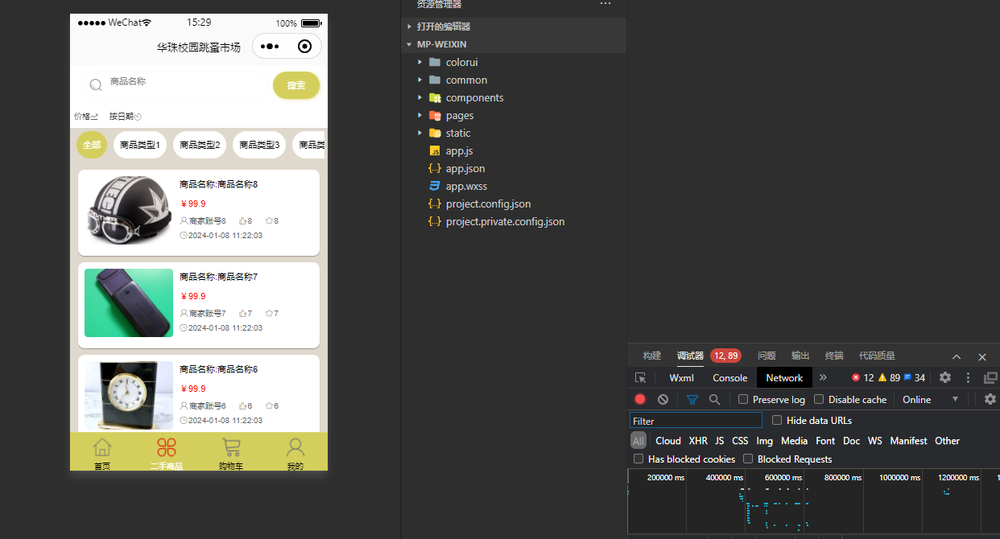
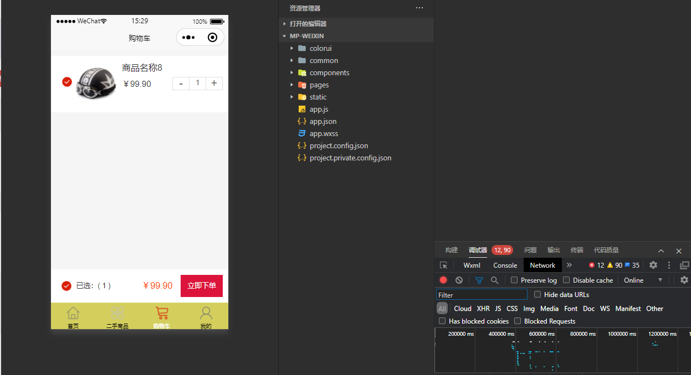
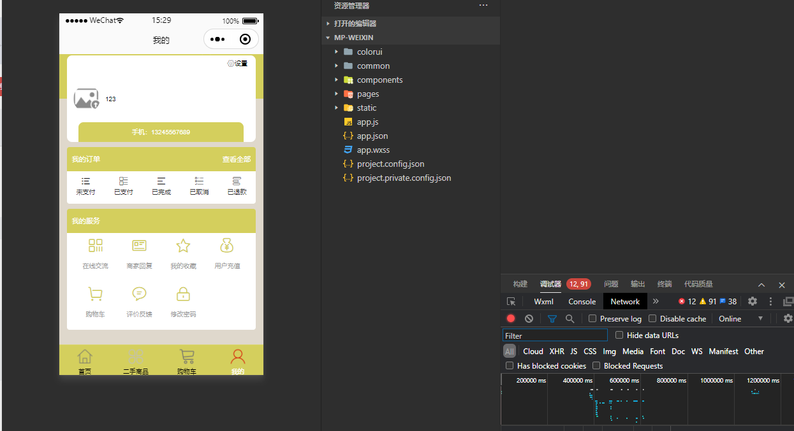

# 基于Java的跳蚤市场系统设计与实现

#### 介绍
基于Java微信小程序的跳蚤市场系统设计与实现；本项目包含：源码+数据库sql+开题报告+论文+说明文档 本项目可以用于毕业设计，白嫖勿扰！ 全网毕业设计项目这里都有 更多项目源码可以私信联系：微信 -- 13283346760

#### 获取源码
微信 -- 13283346760

备注项目名称

#### 研究背景
跳蚤市场系统是一种在线交易平台，允许个人用户在该平台上出售和购买二手商品。这种市场通常提供一个便捷的方式，让用户能够以更实惠的价格获取所需物品，同时也减少了环境负担，通过二手商品的再利用来降低资源浪费。这种市场模式已经在全球范围内迅速发展，为用户提供了广泛的选择和更具经济效益的购物方式。
研究跳蚤市场系统有着广泛的背景和动机。首先，随着电子商务的快速发展，跳蚤市场系统作为一种创新的在线交易方式，具有重要的社会和经济影响。它不仅改变了传统零售模式，还促进了可持续消费的理念，使得人们更加关注资源的有效利用和循环经济的发展。
#### 软件架构

开发环境：JDK8、SpringBoot、Maven、MySQL、Vue、Uniapp

#### 安装教程

1. 下载IDEA集成开发工具
2. 配置Maven环境
3. 启动项目

#### 项目运行截图

